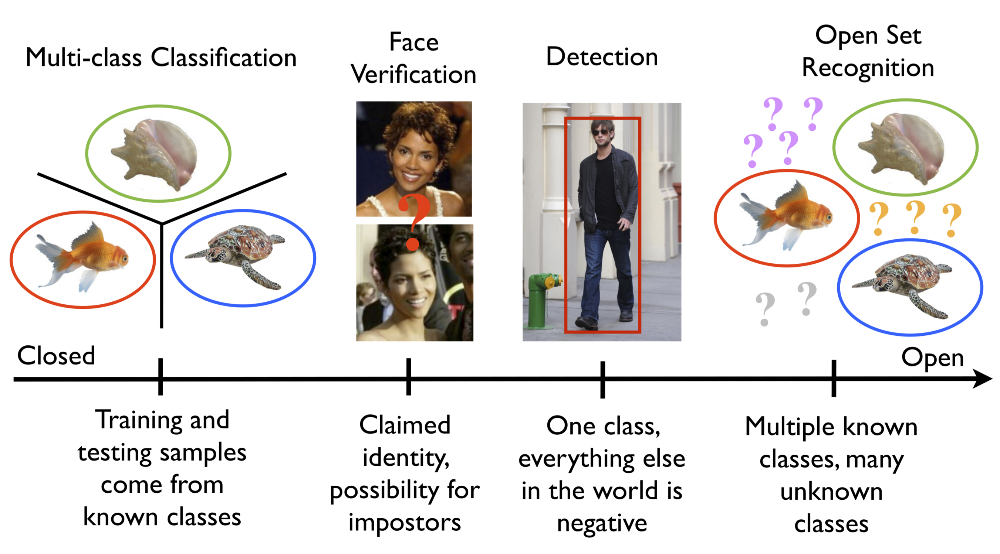
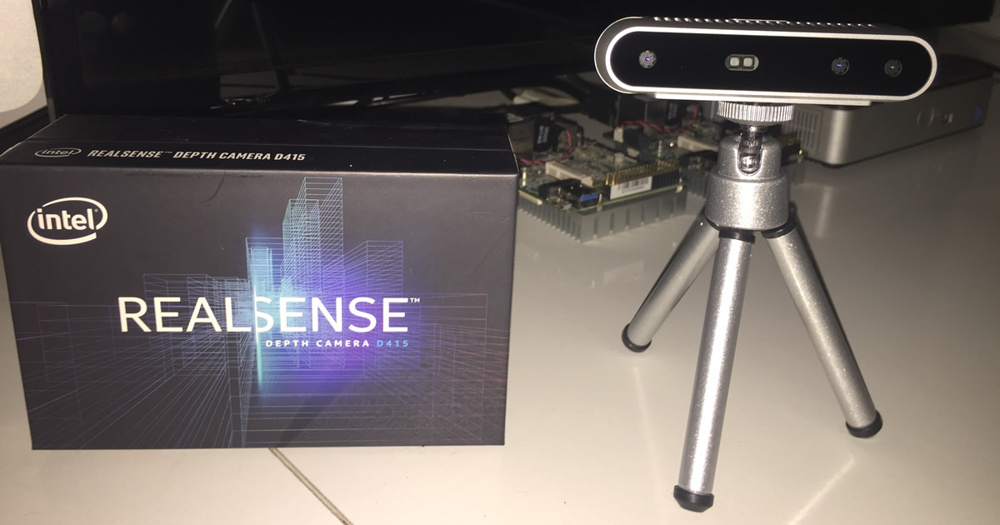

# GeniSysAI TASS Devices

# About GeniSysAI 

GeniSysAI is a project I created for my home and decided to open source a version for others to learn or use at home. The project is a home Artificial Intelligence Assistant Network that uses Computer Vision, Natural Linguistics and the Internet of Things working together to create a single "intelligence". GeniSysAI uses a system based on [TASS A.I](https://github.com/TASS-AI/TASS-Facenet "TASS A.I") for [vision](https://github.com/GeniSysAI/Vision "vision"), an [NLU engine](https://github.com/GeniSysAI/NLU "NLU engine") for natural language understanding, in browser speech synthesis and speech recognition for speech and hearing, and a home [server](https://github.com/GeniSysAI/Server "server") managed via a secure GUI.

# About GeniSysAI TASS Devices

As mentioned above, GeniSysAI TASS Devices are based on tassAI, a computer vision software I made that is able to communicate with applications and devices via the Internet of Things. There are several versions of TASS and several different projects that evolved from the concept. Each version of TASS uses different techniques and technologies to accomplish facial recognition and other computer vision uses. For a full history of tassAI, check out the [tassAI history repo](https://github.com/TASS-AI/Tass-History "tassAI history repo").

**GeniSysAI TASS Devices** currently use Siamese Neural Networks and Triplet Loss ([davidsandberg/facenet Github](https://github.com/davidsandberg/facenet "davidsandberg/facenet")) to classify known and unknown faces. Basically we use the Siamese Neural Networks to calculate the distance between a presented image and a folder of images of known faces. 

The server TASS program is designed to connect to your server webcam, or you can also configure the system to connect to a remote IP cam or Realsense camera. 

## How It Works

There are currently three different versions of GeniSysAI TASS devices: local, Foscam and Realsense (Foscam and Realsense are in development). Each device connects to a stream of one kind or another, processes the frames and streams the modified frames. 

- [Local](https://github.com/GeniSysAI/Vision/tree/master/Local "Local")
- [Foscam](https://github.com/GeniSysAI/Vision/tree/master/Foscam "Foscam")
- [RealSense](https://github.com/GeniSysAI/Vision/tree/master/RealSense "RealSense")

# About Siamese Neural Networks & Triplet Loss
 
As mentioned above, GeniSysAI TASS Devices uses Siamese Neural Networks & Triplet Loss, but what exactly are they? 

Siamese Neural Networks basically are made up of 2 neural networks that are exactly the same, hence the name Siamese Neural Networks. Given two images, we use the identical networks to calculate the similarity between the two images. Basically Siamese Neural Networks learn how to differentiate between objects, or in this case, faces. 

Triplet Loss reduces the difference between an anchor (an image) and a positive sample from the same class, and increases the difference between the ancher and a negative sample from an opposite class. Basically this means that 2 images with the same class (in this case, the same person) will have a smaller distance than two images from different classes (or 2 different people). 

**MORE INFO:** [Lossless Triplet loss, A more efficient loss function for Siamese NN](https://towardsdatascience.com/lossless-triplet-loss-7e932f990b24 "Lossless Triplet loss, A more efficient loss function for Siamese NN")

# The Open Set Recognition Issue
Taken from [Walter J. Scheirer's website](https://www.wjscheirer.com/projects/openset-recognition/ "Walter J. Scheirer's website"):

 

"Both recognition and classification are common terms in computer vision. What is the difference? In classification, one assumes there is a given set of classes between which we must discriminate. For recognition, we assume there are some classes we can recognize in a much larger space of things we do not recognize. A motivating question for our work here is: What is the general object recognition problem? This question, of course, is a central theme in vision. How one should approach multi-class recognition is still an open issue. Should it be performed as a series of binary classifications, or by detection, where a search is performed for each of the possible classes? What happens when some classes are ill-sampled, not sampled at all or undefined?

The general term recognition suggests that the representation can handle different patterns often defined by discriminating features. It also suggests that the patterns to be recognized will be in general settings, visually mixed with many classes. For some problems, however, we do not need, and often cannot have, knowledge of the entire set of possible classes. For instance, in a recognition application for biologists, a single species of fish might be of interest. However, the classifier must consider the set of all other possible objects in relevant settings as potential negatives. Similarly, verification problems for security-oriented face matching constrain the target of interest to a single claimed identity, while considering the set of all other possible people as potential impostors. In addressing general object recognition, there is a finite set of known objects in myriad unknown objects, combinations and configurations - labeling something new, novel or unknown should always be a valid outcome. This leads to what is sometimes called "open set" recognition, in comparison to systems that make closed world assumptions or use "closed set" evaluation."

## Avoiding The Open Set Recognition Issue

With previous versions of TASS built using Tensorflow, [TASS Movidius Inception V3 Classifier](https://www.wjscheirer.com/projects/openset-recognition/ "TASS Movidius Inception V3 Classifier"), the model had issues with the [Openset Recognition Issue](https://www.wjscheirer.com/projects/openset-recognition/ "Openset Recognition Issue"). **TASS Facenet Classifier** uses a directory of known images and when presented with a new image, will loop through each image basically measuring the distance between the known image and the presented image, it seems to overcome the issue so far in small testing environments of one or more people. In a large scenario this method will not be scalable, but is fine for small home projects etc. 

Combining **TASS Movidius Inception V3 Classifier** (prone to open set recognition issues) and **TASS Facenet Classifier** allows us to catch false positives and verify positive classifications using the name/ID of that prediction to quickly index into the images and make a single calculation to determine if Inception classified the person correctly or not using Facenet and making the project more scalable. The latest Inception version of the classifier will be uploaded to this repository soon.

# Intel® Software Innovators

Through my role as an [Intel Software Innovator](https://software.intel.com/en-us/intel-software-innovators/overview "Intel Software Innovator") I am lucky enough to get access to the latest Intel technologies that help me build better projects and make better demos. In this project I use three types of Intel hardware/software:

- Intel® Movidius™ (Neural Compute Stick)
- Intel® RealSense™ (Depth Camera D415)
- Intel®/Aaeon UP Squared Development Board

# Intel® Movidius™ Neural Compute Stick

 

I currently use Intel® Movidius™ Neural Compute Stick in the TASS projects to absorb the computational power of facial classification in the TASS devices, allowing lower powered IoT devices to carry out inference such as UP Squared or Raspberry Pi. Each of the GeniSysAI TASS Device projects have the requirement of at least one Movidius NCS. 

# Intel®/Aaeon UP Squared

 

Except for the local camera devices run on UP Squared IoT development boards. You can also use Linux desktop or laptop devices as well as other IoT development boards such as Raspberry Pi.

# Intel® RealSense™

 

Logitech cameras will work fine with these projects, but the quality is much better and the classification much more accurate when using an Intel RealSense camera. In my home I use an Intel® RealSense™ Depth Camera D415. I also use a program that can connect to my Foscam IP camera, in my home I have the Foscam set to infrared mode permanently. 

# Acknowledgements

- Uses code from Intel® **movidius/ncsdk** ([movidius/ncsdk Github](https://github.com/movidius/ncsdk "movidius/ncsdk Github"))
- Uses code from Intel® **davidsandberg/facenet** ([davidsandberg/facenet Github](https://github.com/davidsandberg/facenet "davidsandberg/facenet"))

# Useful Links

Links to related articles that helped at various stages of the project for research / code examples:

- [Open Set Recognition Issue](https://www.wjscheirer.com/projects/openset-recognition/ "Open Set Recognition Issue")
- [Lossless Triplet loss, A more efficient loss function for Siamese NN](https://towardsdatascience.com/lossless-triplet-loss-7e932f990b24 "Lossless Triplet loss, A more efficient loss function for Siamese NN")
- [PyImageSearch](https://www.pyimagesearch.com/ "PyImageSearch")

# Contributing
Please read [CONTRIBUTING.md](https://github.com/GeniSysAI/Vision/blob/master/CONTRIBUTING.md "CONTRIBUTING.md") for details on my code of conduct, and the process for submitting pull requests to me.

# Versioning
I use SemVer for versioning. For the versions available, see [GeniSysAI/Vision/releases](https://github.com/GeniSysAI/Vision/releases "GeniSysAI/Vision/releases").

# License
This project is licensed under the **MIT License** - see the [LICENSE](https://github.com/GeniSysAI/Vision/blob/master/LICENSE "LICENSE") file for details.

# Bugs/Issues
I use the [repo issues](https://github.com/GeniSysAI/Vision/issues "repo issues") to track bugs and general requests related to using this project. 

# Author
I am a [BigFinite](https://www.bigfinite.com "BigFinite") IoT Network Engneer, part of the team that works on the core IoT software for our platform. In my spare time I am an [Intel Software Innovator](https://software.intel.com/en-us/intel-software-innovators/overview "Intel Software Innovator") in the fields of Internet of Things, Artificial Intelligence and Virtual Reality.  

